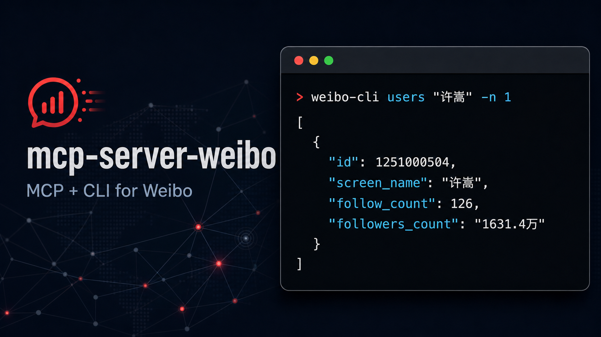

# Weibo MCP Server



通过微博访客接口提供用户、微博、热搜、评论、话题及社交关系数据。默认自动申请访客 Cookie，不读取用户手工提供的 Cookie；CLI 可通过扫码登录保存本机登录会话。

## 选择适合你的方式

| 你的目标 | 选择 |
|---|---|
| 让支持 Skill 的编码代理按项目约定调用 CLI | [Weibo CLI Skill](skills/SKILL.md) |
| 让 Claude、Cursor 或其他 AI 客户端自主调用微博工具 | [MCP 接入指南](docs/MCP.md) |
| 在终端、脚本或管道中直接取得 JSON 数据 | [CLI 使用指南](docs/CLI.md) |

## 快速开始

### MCP

```json
{
  "mcpServers": {
    "weibo": {
      "command": "uvx",
      "args": ["--from", "mcp-server-weibo", "mcp-server-weibo"]
    }
  }
}
```

HTTP 模式使用 Streamable HTTP 端点 `http://localhost:4200/mcp`。完整配置、工具清单与测试方法见 [MCP 接入指南](docs/MCP.md)。

### CLI

```bash
uvx --from mcp-server-weibo weibo-cli trending -n 3
uvx --from mcp-server-weibo weibo-cli users "雷军" -n 5
uvx --from mcp-server-weibo weibo-cli feeds 1749127163 -n 10 --no-include-pics

# 可选：扫码创建本机 CLI 登录会话
uvx --from mcp-server-weibo weibo-cli login

# 校验当前本机 CLI 登录会话
uvx --from mcp-server-weibo weibo-cli session
```

集合查询命令输出一个完整 JSON 数组；`profile` 输出对象，`session` 输出登录会话对象或 `null`。完整命令、分页和精简输出选项见 [CLI 使用指南](docs/CLI.md)。

## 从源码运行

```bash
git clone https://github.com/qinyuanpei/mcp-server-weibo.git
cd mcp-server-weibo
uv sync --extra dev

# MCP：stdio 或 HTTP
uv run mcp-server-weibo
uv run mcp-server-weibo http

# CLI
uv run weibo-cli --help
```

## 要求与声明

- Python >= 3.10
- MIT License，详见 [LICENSE](LICENSE)
- 本项目与微博官方无关，仅用于学习和研究。
